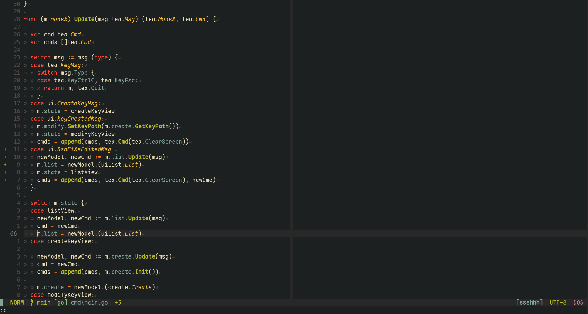
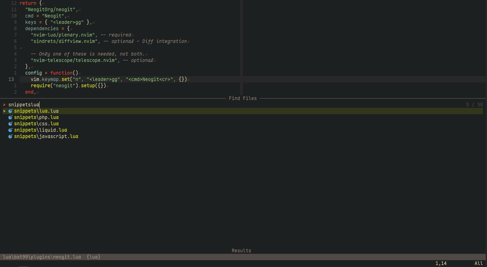

- Font is [Maple font](https://github.com/subframe7536/maple-font)
- Theme is [Gruvbox Material](https://github.com/sainnhe/gruvbox-material) and [Kanagawa](https://github.com/rebelot/kanagawa.nvim)
- Lazy package manager (of course)

General view

Find files

